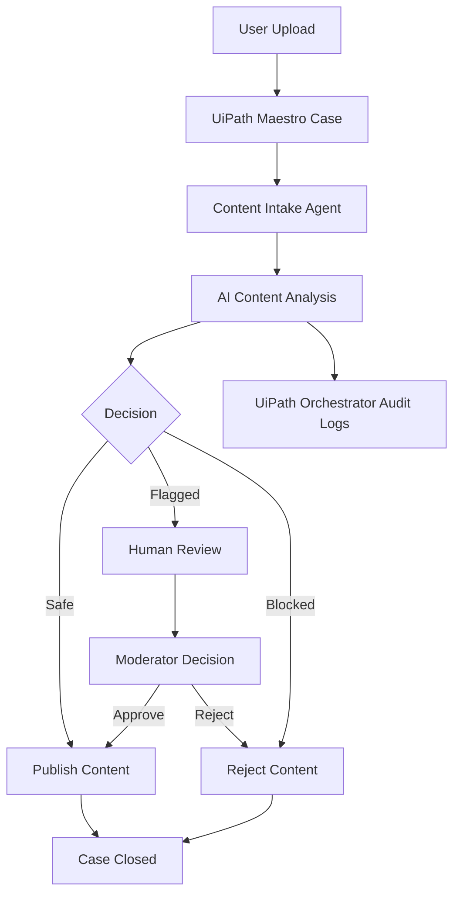

# Architecture

## Overview

**SentriAI** is an AI-powered content moderation system that uses **UiPath Maestro Case** to orchestrate intelligent moderation workflows. Every uploaded text, image, or video is treated as a moderation case, analyzed by AI agents, and routed for automatic approval, human review, or blocking based on the moderation result.

---

## Components

| Layer                   | Component            | Role                                                    |
| ----------------------- | -------------------- | ------------------------------------------------------- |
| User / Business Process | Platform Users       | Upload text, images, or videos for moderation           |
| Process Orchestration   | UiPath Maestro Case  | Creates and manages moderation cases                    |
| AI Agents               | UiPath Agent Builder | Analyzes text, images, and videos using AI              |
| Execution               | UiPath Orchestrator  | Runs agents, manages jobs, and stores execution history |
| Human Governance        | UiPath Action Center | Reviews flagged content before final approval           |

---

## Workflow

---

## Agent Output Contract

The SentriAI Agent returns structured JSON containing:

* `contentType`
* `classification`
* `decision`
* `confidence`
* `toxicityScore`
* `requiresHumanReview`
* `policyViolated`
* `recommendedAction`
* `auditNotes`

---

## Safety Behavior

If the AI confidence score is low or the content cannot be classified with certainty, the system does not make an automatic decision. Instead, it escalates the moderation case to **UiPath Action Center** for human review, ensuring transparency, governance, and safe decision-making.
